<div align="center">

# Task Notes

**A local-first personal operating system for your work — tasks, projects, learning, ideas, and a weekly review that tells you what actually happened.**

Runs entirely on your machine. Plain JSON files. No account, no cloud, no telemetry.

macOS desktop app · zero runtime dependencies · single-file frontend

</div>

<br>

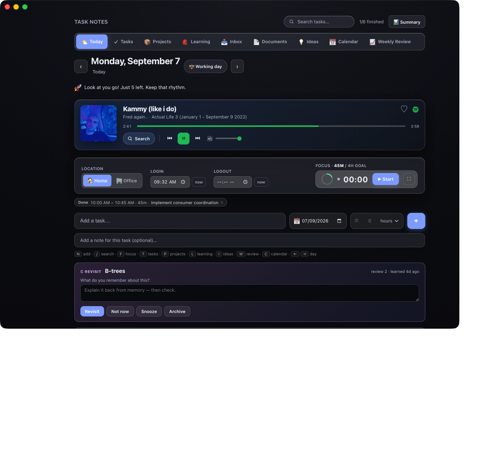

<br>

## Why this exists

Most productivity apps are one CRUD list wearing six different hats. This one is built around the idea that you think about your work in genuinely different ways:

|  | answers |
|---|---|
| **Tasks** | What do I need to **do**? |
| **Projects** | What am I trying to **accomplish**? |
| **Learning** | What do I want to **understand**? |
| **Ideas** | What might I **pursue**? |
| **Documents** | What have I actually **written down**? |
| **Inbox** | What did I **just think of**? |
| **Calendar** | **When** — and in what context? |
| **Weekly Review** | What actually **happened**? |

They aren't separate apps bolted together. A task belongs to a project, references something you're learning, and shows up in the weekly review — and it's the same underlying record everywhere you look at it.

<br>

## The Learning Bag

The part I'm most fond of. You constantly run into things you realise you don't properly understand — *"I should really know how mutexes work."* You don't want a task. You want to throw it in a bag and get to it.

So the bag is an actual bag. Chips sit inside it at slightly odd angles, they shift as you move your cursor through them, and clicking one animates it out of the bag and into today's learning.

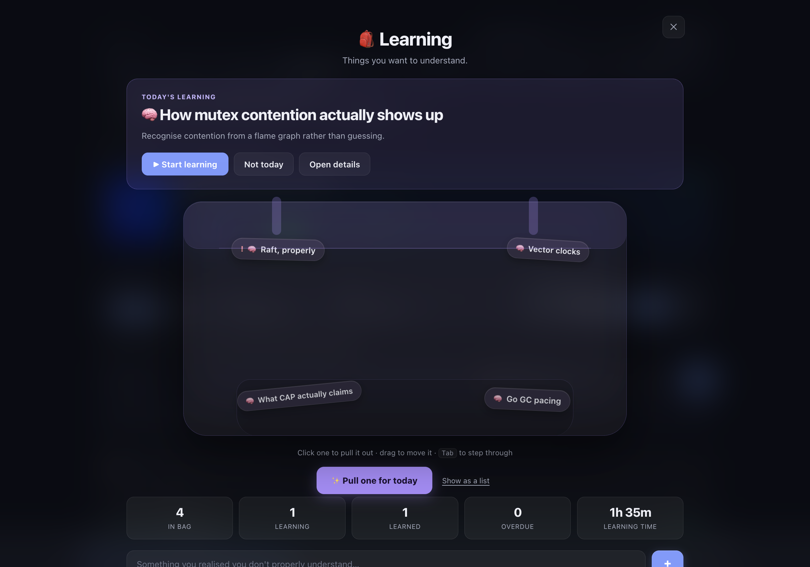

Hover anything for a preview — you shouldn't need to open a modal just to remember what a thing was.

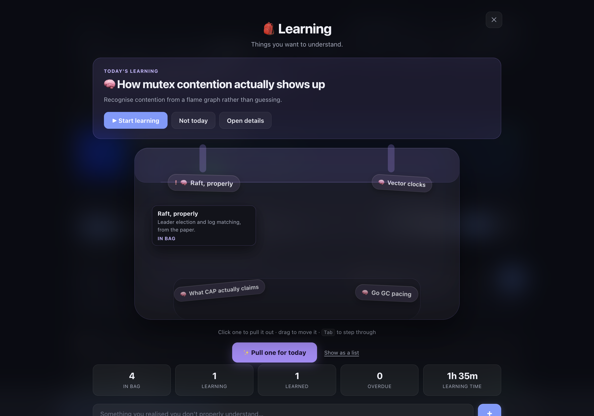

**Pull one for today** picks for you with a light weighting — never studied, overdue, high priority, and how long it's been sitting all count, plus a little randomness — so the bag doesn't quietly become a graveyard. Starting a topic opens a **learning session** that tracks time, notes and what you actually understood. Nothing is ever auto-marked "Learned"; that stays your call.

Every item keeps the full detail behind it: what you want to understand, why you added it, context, source, priority, status, tags, notes, related project, related tasks, time spent, last studied.

Prefer not to rummage? There's a plain list view, every chip is keyboard-reachable, and `prefers-reduced-motion` turns the physics off while keeping the whole workflow.

<br>

## A knowledge workspace, not a notes tab

Documents are a first-class entity with their own workspace: a sidebar (pinned, recent, tags, folders, full-text search), tabs, a markdown editor, a reading view, a resizable split, an outline, and distraction-free writing.

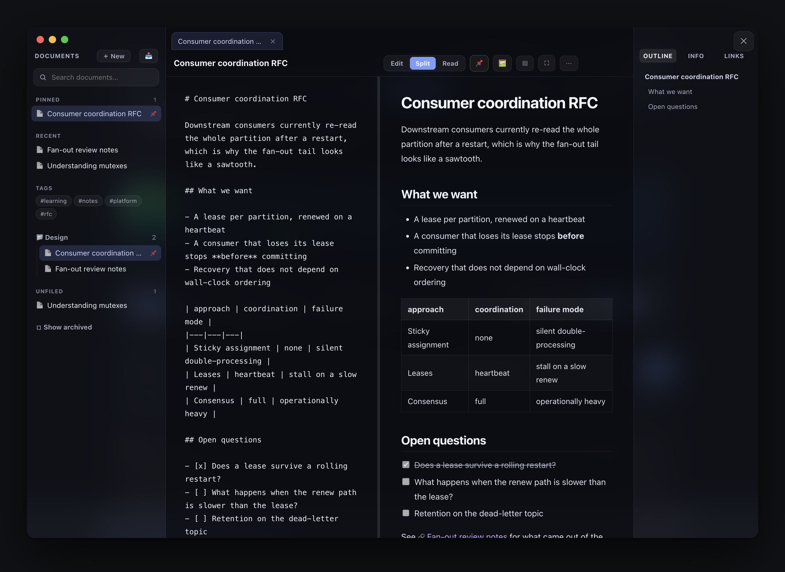

Markdown is rendered by a small purpose-built engine — GFM tables, task lists, fenced code with syntax highlighting, blockquotes, images — with **every URL allowlisted and every value escaped**, so a pasted document can't smuggle script into the app.

**`[[Wiki links]]`** are real relationships: they resolve to documents, offer to create the page when it doesn't exist yet, and produce **backlinks** on the other side.

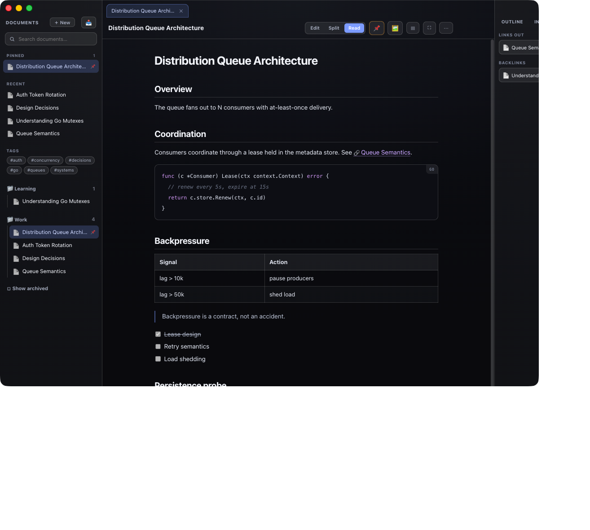

**Images** paste, drop, or pick from a file dialog. They're stored on disk beside the document and served from the app — never a temporary blob URL, so they survive reload and packaging. Existing `.md` files can be imported and kept.

**One document, many contexts.** A document links to a Project, a Task, a Learning item and an Idea, and shows up in each of them — the same record, never a copy. Creating a document from any of those carries the context automatically.

<br>

## Capture first, decide later

You constantly think of things mid-task. The Inbox is a buffer: dump it now, decide what it is later.

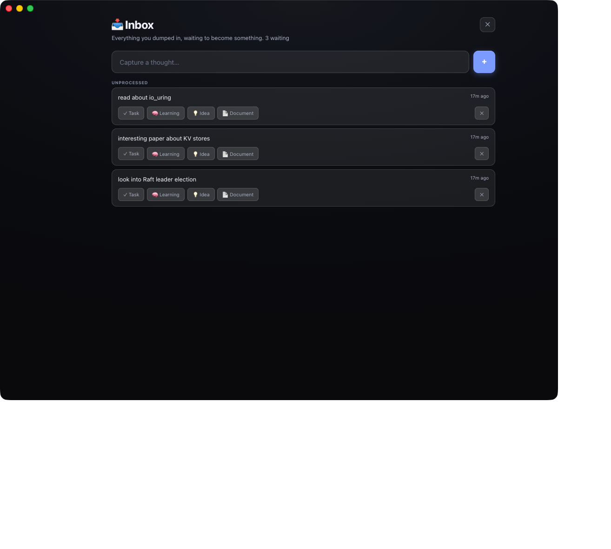

On macOS, **⌘⇧Space** opens a tiny always-on-top capture window from anywhere — VS Code, a browser, anywhere. It writes straight to the same store; the main window doesn't need to be open.

<br>

## Knowledge that comes back

Marking something "Learned" usually means never seeing it again. Learned topics resurface on a widening schedule (5 → 13 → 30 → 60 → 120 days), pulled in sooner if you keep postponing them or flagged them high priority.

When one comes up you're asked what you remember **before** you're shown your notes — recall, not rereading. Revisit, not now, snooze, or archive.

<br>

## Projects that know their own progress

Progress is computed from real tasks — never a number you typed in.

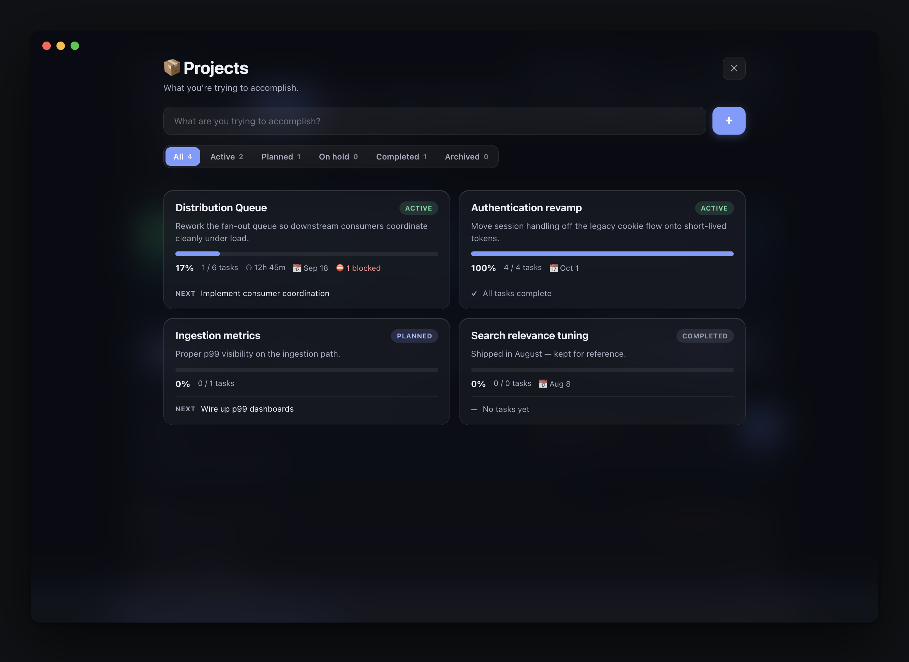

Each project opens into a command center: **health**, progress, completed/remaining/blocked, time spent (derived from focus sessions), tasks grouped by status, learning topics, documents, dependencies, notes, and its own history.

Health is explained in words, never an opaque score — *"Active this week, nothing blocked"*, *"No activity for 9 days"*, *"3 blocked tasks and deadline approaching"* — plus a momentum strip of tasks finished per week. Tasks can **depend on** other tasks; a blocked one says what it's waiting on, and the project shows the chain.

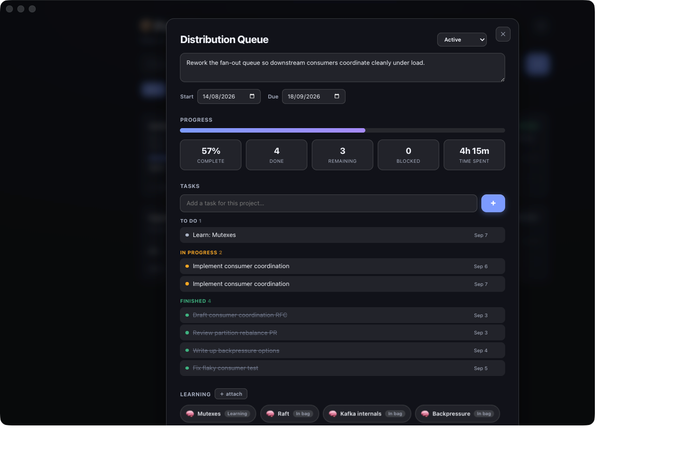

<br>

## Ideas → Projects

Ideas are for thoughts you haven't committed to. Capture fast, expand later, and when one earns it, convert it into a project — carrying its description, notes and tags across instead of leaving you with a blank page.

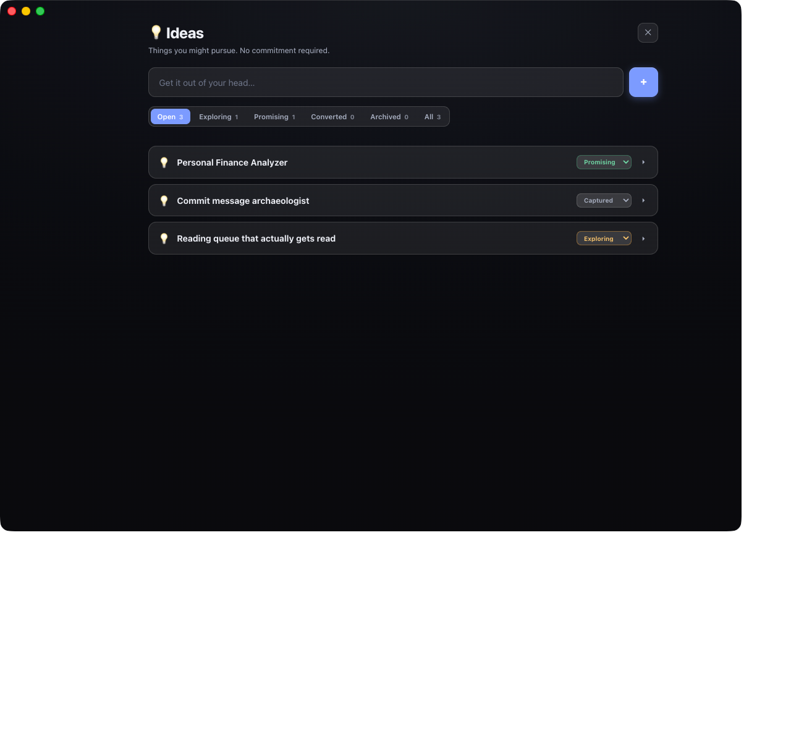

<br>

## Weekly Review

One page you look at once a week. Focus time, tasks completed, projects that moved (and by how much), what you learned, work vs personal split, and the flow through your learning bag — all from real data.

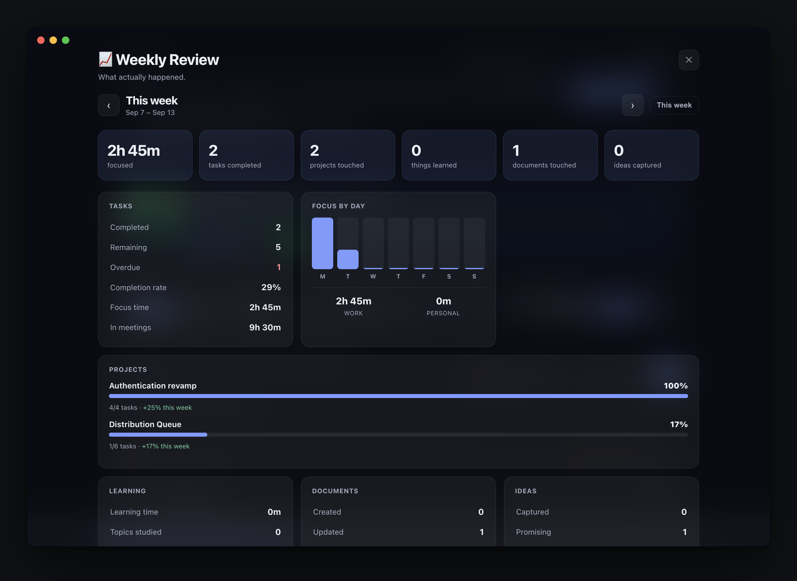

Past weeks are **snapshotted** the first time you view them after they end, so history stays honest instead of quietly rewriting itself as your current data changes. Your written reflections — what went well, what didn't, what's next — persist per week and stay editable forever.

<br>

## Focus

A full-screen focus mode with pause/resume, a daily goal ring, and a session log. A session attaches to **what you're actually doing** — a task, project, learning item or document — and shows that thing's context while you work. Quick thoughts go on the session itself, and when you stop it asks what you accomplished and what's next (the "next" becomes a capture so it isn't lost).

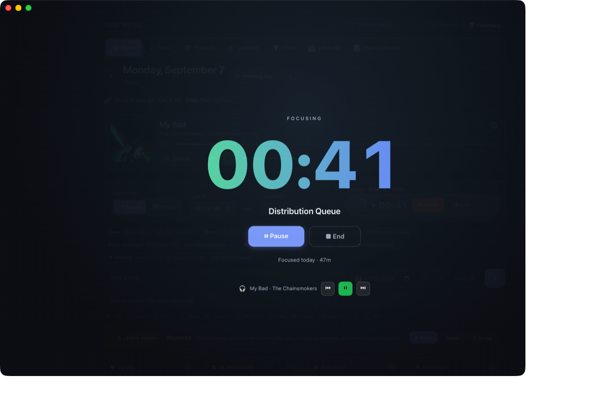

On macOS, starting a focus session also opens a small **always-on-top companion window** so the timer stays with you while you work in your editor:

```
┌──────────────────────────┐
│ ● FOCUSING               │
│         42:18            │
│  🎧 Bloody Samaritan     │
│    ⏸    ■    ⏮ ▶ ⏭      │
└──────────────────────────┘
```

It's the *same* session — one timer, one music player. Pause in the mini window and the main app pauses; resume in the app and the mini window follows. It remembers where you put it, survives app reloads, and because the timer is derived from timestamps rather than ticks, it stays correct across sleep/wake.

<br>

## Your real calendar

Task Notes reads the calendars already on your Mac — including a work Google Workspace account added through **System Settings → Internet Accounts**. That route matters: macOS does the OAuth through Apple's own verified client, so it works on managed accounts where a third-party app would be blocked outright.

Today's meetings sit above the board: what's on, what's next, how much of the day is already spoken for. All-day items are separated out, and declined or cancelled invitations don't clutter it.

Open a meeting and it becomes something you can act on — **focus until it starts** (the timer counts down to it), turn it into a task, or spin up a notes document pre-filled with the time, organiser and an actions checklist. The month grid marks days that have meetings, the Weekly Review reports hours spent in them, and a meeting-heavy day quietly changes the day's suggestions from deep work to something that fits between calls.

There is a full **Calendar page** too — **Day**, **Week**, **Month** and **Year** — reading the same calendars. Day and Week are hour grids with overlapping meetings laid out side by side and a line showing where you are in the day; Month lists what is on each day; Year marks the days that have anything on them. Clicking any day drops into it.

Last week through next month is fetched in one call and kept, so moving between days and months does not wait on anything. A day it does not yet hold says it is loading — it will never show you one day's meetings under another day's date.

**New meetings find you.** Invitations arrive while you are working, and a calendar you only read is one you hear about too late, so Task Notes watches the coming week and tells you when a meeting is added or moved. Recurring series are understood, so your standing weekly meetings do not announce themselves every few minutes.

You can also **manage the calendar from here**: add an event, edit one, or delete it. Moving the start drags the end along so the duration holds. Every occurrence of a recurring series shares one identifier in EventKit, so editing "Wednesday's standup" the naive way changes Monday's — the app addresses the occurrence you actually opened, and says so before it changes anything. Writes go to the calendar macOS already syncs, so an event created in Task Notes turns up in Google Calendar — without this app ever holding a token of its own. Pick which calendars are included from the ⚙ on the agenda.

Event data never leaves the machine.

Under the hood this is a small compiled EventKit helper (`helpers/tn-calendar`), not AppleScript — driving Calendar.app over Apple events takes about eleven seconds for a single week even when it returns nothing, which is far too slow to sit behind a request. EventKit answers in milliseconds and doesn't need Calendar.app running. macOS will ask for Calendar permission the first time. **Full Access** is needed to *read* your agenda; "Add Events Only" is enough to *add* events, and the app asks for only what each action requires.

Why not a Google sign-in? Because it would be strictly worse: a sensitive Calendar scope from an unverified personal app is the category a Workspace admin normally blocks, and it would mean storing a client secret and refresh token on disk. Going through the account macOS already holds needs no approval and no credentials here.

<br>

## Calendar & day context

Mark days as working, off, vacation or holiday; track home vs office and login/logout. The rest of the app uses that context — for example, Learning nudges you more gently on days you actually have room to breathe.

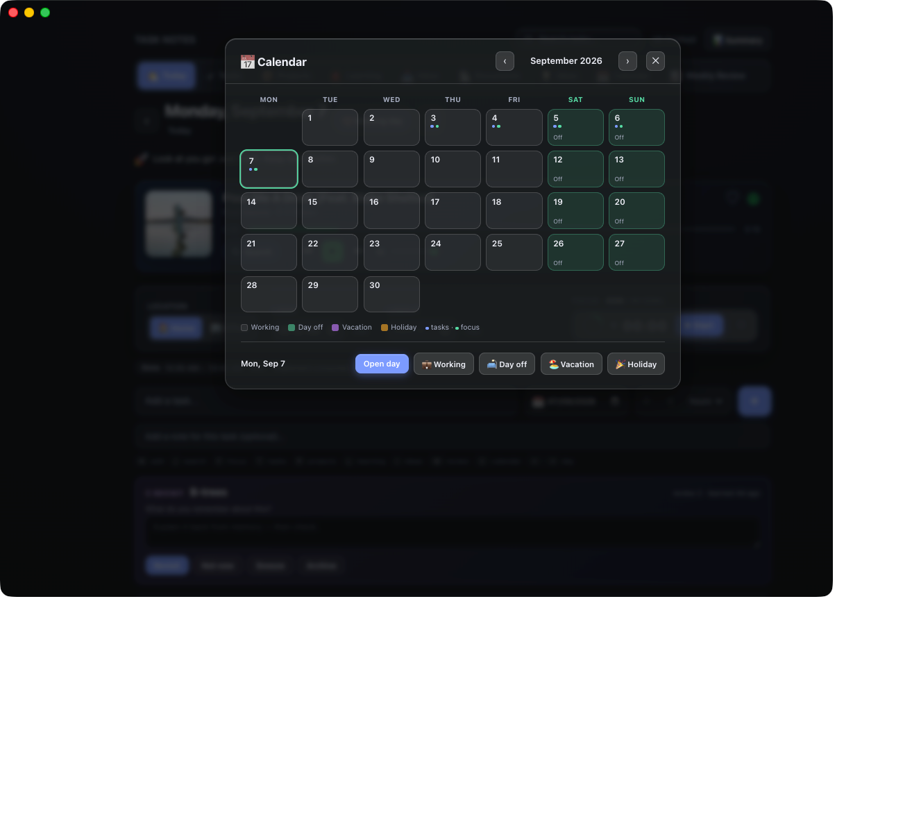

<br>

## Every task, everywhere

The board is where you work a single day. The Tasks page is every task you have, across every day — grouped by date, filterable by state and project, and showing what each one is attached to.

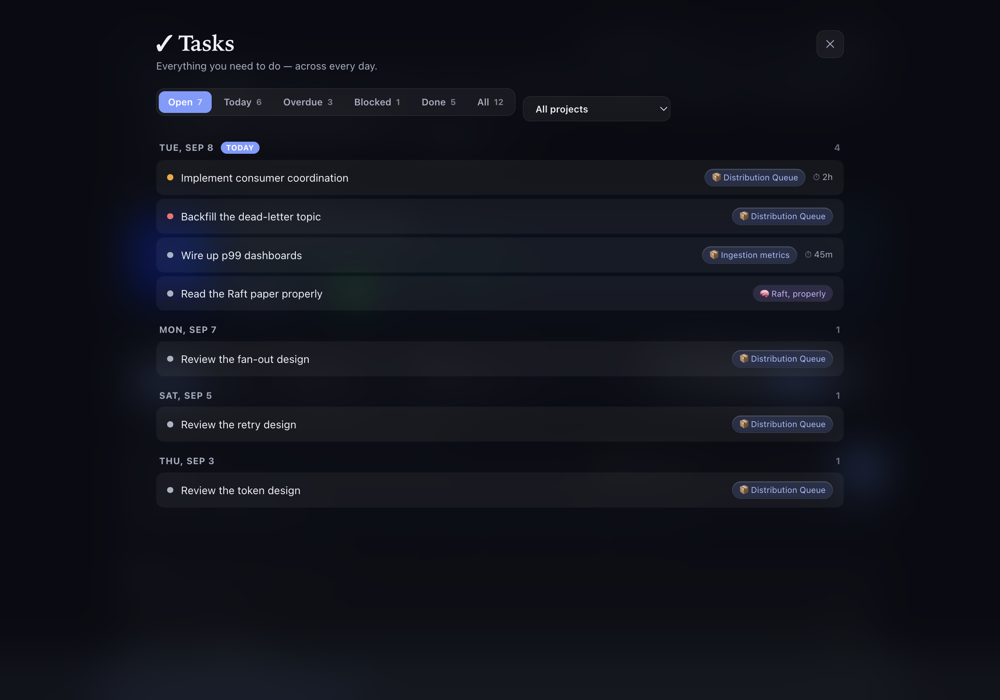

<br>

## Everything else

- **Kanban board** — To Do / In Progress / Blocked / Finished, drag between columns, confetti when you finish something
- **Carry-forward** — unfinished tasks follow you to the next day, with a carry count so you notice what keeps slipping
- **Global task view** — every task across every day, filterable by state and project
- **Estimates vs actuals** — estimate a task, then see it against the time you actually focused
- **Spotify control** — play/pause, skip, volume, seek and search-and-play against the desktop app (optional)
- **Continue where you left off** — a strip of the documents, learning, projects and tasks you were actually in the middle of
- **Day-aware suggestions** — the app knows if you're at the office, working from home or off, and suggests accordingly (it never schedules anything for you)
- **Things that have gone quiet** — stale projects, tasks, learning, ideas and documents, with keep / snooze / archive, so commitments don't silently pile up
- **Command palette** (⌘K) — every command that actually does something, plus document search
- **Search, keyboard shortcuts, and a motion language** that's meant to be felt more than noticed

<br>

## Running it

Requires Node.js. There are no dependencies to install for the server.

```bash
node server.js
```

Then open <http://localhost:4321>.

### Build the macOS app

```bash
npm install
npm run dist
```

That produces `dist-app/Task Notes-<version>-arm64.dmg`. The build is unsigned, so the first launch needs right-click → Open.

<br>

## Your data

Everything lives in `data/`, which is git-ignored:

| file | holds |
|---|---|
| `YYYY-MM-DD.json` | that day's tasks |
| `YYYY-MM-DD.meta.json` | that day's login/logout, location, day type, focus sessions, today's learning |
| `projects.json` | projects |
| `learning.json` | the learning bag |
| `ideas.json` | ideas |
| `activity.json` | the activity log that feeds project history and the weekly review |
| `reviews.json` | weekly reflections and frozen week snapshots |
| `captures.json` | the capture inbox |
| `documents.json` | document metadata (never bodies) |
| `docs/<id>.md` | one plain markdown file per document — readable outside the app |
| `docs/<id>.versions.json` | recent version history for that document |
| `assets/<id>/…` | images embedded in that document |

Plain JSON you can read, back up, grep, or edit by hand. The desktop app stores it in `~/task-notes/data`; set `TASKNOTES_DATA` to point it somewhere else.

Nothing leaves your machine. The only outbound calls are the ones Spotify makes if you choose to use it.

<br>

## Keyboard shortcuts

| key | |
|---|---|
| `N` | add a task |
| `/` | search |
| `F` | focus mode |
| `T` `P` `L` `I` `W` | Tasks · Projects · Learning · Ideas · Weekly Review |
| `C` | capture a thought |
| `⌘K` | command palette |
| `⌘⇧Space` | global quick capture (anywhere on macOS) |
| `←` `→` | previous / next day |
| `Esc` | close whatever's open |

<br>

## Architecture

Deliberately small and boring so it stays hackable:

- **`server.js`** — a zero-dependency Node HTTP server. Serves the frontend and a small JSON API over the files above.
- **`public/index.html`** — the entire frontend. One file: markup, styles and logic, including a dependency-free markdown parser, sanitiser and highlighter.
- **`public/mini.html` / `public/capture.html`** — the two small native companion windows.
- **`helpers/tn-calendar.swift`** — a read-only EventKit helper that prints JSON; built by `npm run build:helper`, which `npm run dist` runs for you.
- **`main.js` / `preload.js`** — the Electron shell for the macOS app and the Focus companion window, talking over a tiny explicit IPC bridge.

<br>

## License

MIT
