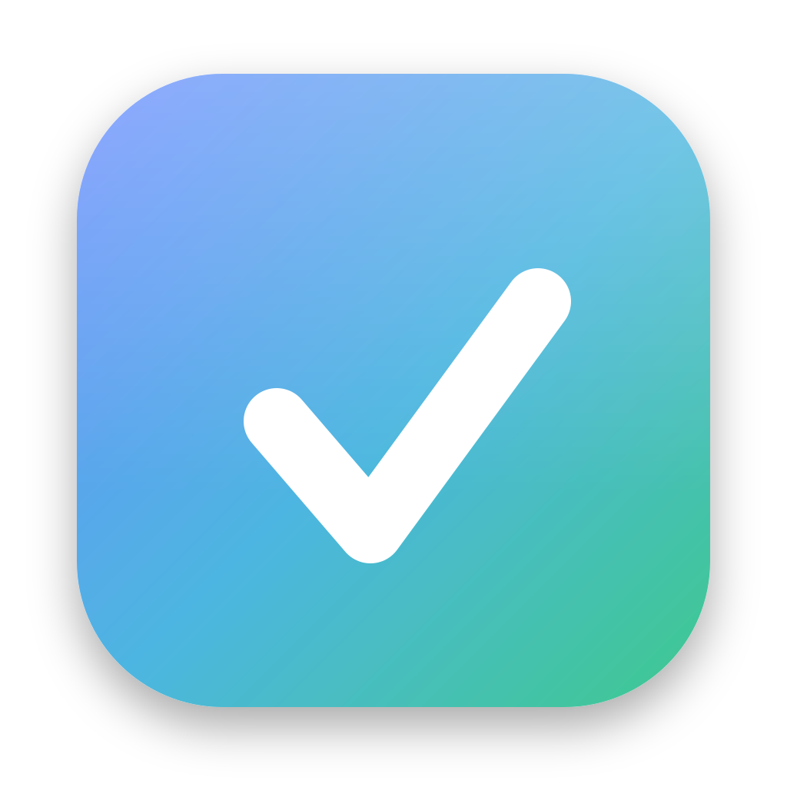

# Task Notes

A personal, local-first daily task board with a focus timer, projects hub, calendar, and Spotify control — packaged as a native macOS app. Zero-dependency Node backend, single-file frontend.



## Features

- **Kanban board** — To Do / In Progress / Blocked / Finished, drag between columns, confetti on finish
- **Per-day** — one JSON file per day, unfinished tasks carry over automatically
- **Task details** — estimate, note, people, required pick-up date, and estimate-vs-actual focus time
- **Focus timer** — pause / resume / end (one continuous session), a full-screen focus mode, a daily goal ring, and a session log
- **Projects & Goals hub** — track projects / learning / ideas, break them into tasks, pick tasks up onto the board, and focus on a project (time accrues per project)
- **Calendar** — month view; mark days Working / Off / Vacation / Holiday
- **Day types** — weekends default to off; encouraging messages; login/logout + Home/Office on working days
- **Summary** — week/month focus, tasks finished, office vs home, estimate accuracy
- **Spotify** — control the desktop app (play/pause/skip, volume, seek), rich now-playing card, and search-and-play songs / albums / playlists
- **Liquid-glass UI** with a search, keyboard shortcuts, and light/dark-agnostic dark theme

## Run it

Requires Node.js.

```bash
node server.js
# then open http://localhost:4321
```

## Build the macOS app

```bash
npm install
npm run dist        # produces dist-app/Task Notes-*.dmg
```

## Data

All personal data lives in `data/` (git-ignored): one JSON file per day, `projects.json`, and — if you use Spotify search — `spotify.json` (your app keys). Nothing leaves your machine except calls Spotify itself makes.

## Keyboard shortcuts

`N` add · `/` search · `F` focus · `P` projects · `C` calendar · `S` summary · `←` `→` change day
