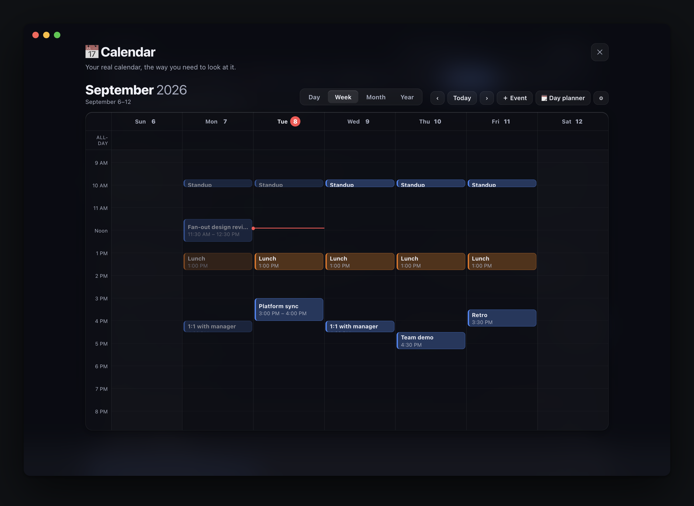
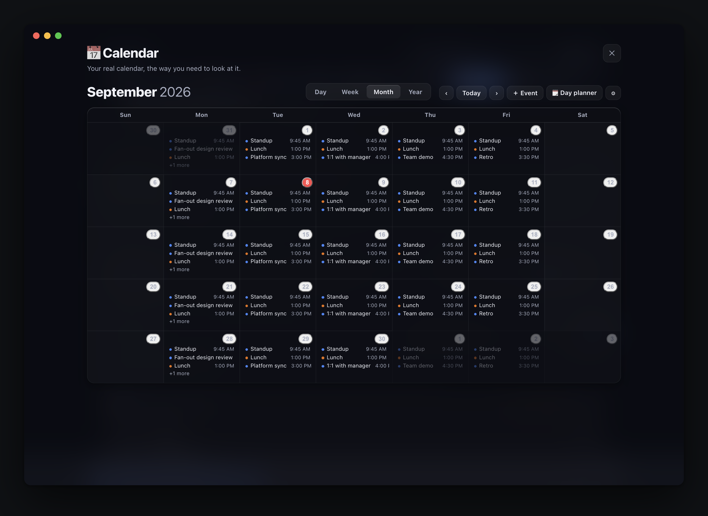

<div align="center">

# Task Notes

**A local-first personal operating system for your work — tasks, projects, learning, ideas, and a weekly review that tells you what actually happened.**

Runs entirely on your machine. Plain JSON files. No account, no cloud, no telemetry.

macOS desktop app · zero server dependencies · single-file frontend

</div>

<br>


<br>

## Why this exists

Most productivity apps are one CRUD list wearing six different hats. This one is built around the idea that you think about your work in genuinely different ways:

|  | answers |
|---|---|
| **Tasks** | What do I need to **do**? |
| **Projects** | What am I trying to **accomplish**? |
| **Learning** | What do I want to **understand**? |
| **Ideas** | What might I **pursue**? |
| **Documents** | What have I actually **written down**? |
| **Inbox** | What did I **just think of**? |
| **Calendar** | **When** — and in what context? |
| **Weekly Review** | What actually **happened**? |

They aren't separate apps bolted together. A task belongs to a project, references something you're learning, and shows up in the weekly review — and it's the same underlying record everywhere you look at it.

<br>

## The Learning Bag

The part I'm most fond of. You constantly run into things you realise you don't properly understand — *"I should really know how mutexes work."* You don't want a task. You want to throw it in a bag and get to it.

So the bag is an actual bag. Chips sit inside it at slightly odd angles, the crowd parts a little as your cursor moves through it, and clicking one animates it out of the bag and into today's learning.

The chip you are reaching for **holds still**. An earlier version pushed every chip away from the cursor, which meant the one you wanted fled as you approached it and nothing could be caught; now the nearest chip is a fixed target that grows slightly and comes to the front, only its neighbours yield, and they yield by a few pixels rather than darting. Chips can also be **dragged** and stay where you drop them, so the bag can be arranged the way you think about it.


Hover anything for a preview — you shouldn't need to open a modal just to remember what a thing was.


**Pull one for today** picks for you with a light weighting — never studied, overdue, high priority, and how long it's been sitting all count, plus a little randomness — so the bag doesn't quietly become a graveyard. Starting a topic opens a **learning session** that tracks time, notes and what you actually understood. Nothing is ever auto-marked "Learned"; that stays your call.

Every item keeps the full detail behind it: what you want to understand, why you added it, context, source, priority, status, tags, notes, related project, related tasks, time spent, last studied.

Prefer not to rummage? There's a plain list view, every chip is keyboard-reachable, and `prefers-reduced-motion` turns the physics off while keeping the whole workflow.

Learning is purple throughout. Amber stays the app's "in progress" colour, so a topic and a task in flight are never confusable at a glance.

<br>

## A knowledge workspace, not a notes tab

Documents are a first-class entity with their own workspace: a sidebar (pinned, recent, tags, folders, full-text search), tabs, a block editor, a markdown source view, a reading view, a resizable split, an outline, and distraction-free writing.


**Writing is block-based, not markdown-typing.** A heading looks like a heading as you write it, `**` never appears on screen, `/` opens a block menu, selecting text raises a formatting bar, and blocks drag to reorder. Lists indent with Tab, Enter on an empty list item ends the list, and Backspace at the start of a block merges it into the one above.

Every block has its own actions on the handle beside it — turn into, duplicate, move, delete — which is also the only way to remove a diagram, since one showing its picture has no text in it to put a caret in. The gutter appears on focus as well as on hover, the block menu is a real listbox that reports its selection, every control is labelled, and there is one visible focus ring throughout, so the editor is usable without a mouse.

A code block carries its language as a pill you pick from a list, is syntax-highlighted as you type — re-coloured on a pause, with the caret held by character offset and left alone mid-composition so an IME is never pulled apart — and can be copied or left from its own header. Four things leave it: Escape, ⌘Enter, a blank line then Enter, or that button. If it's the last block in the document a paragraph is created below, because being unable to get back out is the worst thing an editor can do to you.

**Diagrams render where you write them.** Set a code block's language to `mermaid` and it becomes the drawing — flowcharts, sequence diagrams, the rest — in a hand-drawn style, themed to match the app rather than dropped in as a foreign white rectangle. Toggle to **Source** to edit it, Escape to go back. The fence stays an ordinary ```mermaid block in the markdown, so the diagram is still just text in your file, and GitHub renders it too.

The file on disk is still a plain `.md`. The block editor is a *view* over the markdown rather than a separate format: every edit is serialised straight back to markdown, which then goes through the same autosave, draft and conflict handling as before. Anything the editor does not model — an HTML block, an indented code block, a footnote — is carried through untouched instead of being reformatted, and the round trip is idempotent, so opening a document never rewrites it. Prefer the source? **Edit** and **Split** are still there.

Markdown is rendered by a small purpose-built engine — GFM tables, task lists, fenced code with syntax highlighting, blockquotes, images — with **every URL allowlisted and every value escaped**, so a pasted document can't smuggle script into the app.

**`[[Wiki links]]`** are real relationships: they resolve to documents, offer to create the page when it doesn't exist yet, and produce **backlinks** on the other side.


**Images** paste, drop, or pick from a file dialog. They're stored on disk beside the document and served from the app — never a temporary blob URL, so they survive reload and packaging. Existing `.md` files can be imported and kept.

**One document, many contexts.** A document links to a Project, a Task, a Learning item and an Idea, and shows up in each of them — the same record, never a copy. Creating a document from any of those carries the context automatically.

<br>

## Capture first, decide later

You constantly think of things mid-task. The Inbox is a buffer: dump it now, decide what it is later.


On macOS, **⌘⇧Space** opens a tiny always-on-top capture window from anywhere — VS Code, a browser, anywhere. It writes straight to the same store; the main window doesn't need to be open.

<br>

## Backlog

Work you have decided on but are not doing yet. It sits collapsed under the board as a single line — `› Backlog 7 · 2 ready` — and stays out of the way until you click it.

Adding something always asks when it should come back: **Tomorrow · Next week · Next month**, a date, or **No date yet**. You are never refused — a half-formed thought still lands — but an undated item says so plainly on its row rather than quietly becoming something that never returns.

On the day an item comes due you get one native notification, once. **Pull in** puts it on the board for the day you're looking at; the backlog keeps the record of which task it became, so it reads as what came out of it, not just what's left.

Backlog items live in their own store rather than in a day file — a backlog item has no day, and parking one in a future day file would put it in the path of the carry-forward reconciliation, which would then drag it between days as though it were live work.

<br>

## Knowledge that comes back

Marking something "Learned" usually means never seeing it again. Learned topics resurface on a widening schedule (5 → 13 → 30 → 60 → 120 days), pulled in sooner if you keep postponing them or flagged them high priority.

When one comes up you're asked what you remember **before** you're shown your notes — recall, not rereading. Revisit, not now, snooze, or archive.

<br>

## Projects that know their own progress

Progress is computed from real tasks — never a number you typed in.


Each project opens into a command center: **health**, progress, completed/remaining/blocked, time spent (derived from focus sessions), tasks grouped by status, learning topics, documents, dependencies, notes, and its own history.

Health is explained in words, never an opaque score — *"Active this week, nothing blocked"*, *"No activity for 9 days"*, *"3 blocked tasks and deadline approaching"* — plus a momentum strip of tasks finished per week. Tasks can **depend on** other tasks; a blocked one says what it's waiting on, and the project shows the chain.


The two destructive controls say which they are, because they are easy to confuse and expensive to get wrong. **Unlink** takes a task out of the project and leaves it on its day. **🗑** deletes the task itself. And deleting a project asks first, naming it and how many tasks go with it — it takes them, rather than leaving orphans pointing at something that no longer exists.

<br>

## Ideas → Projects

Ideas are for thoughts you haven't committed to. Capture fast, expand later, and when one earns it, convert it into a project — carrying its description, notes and tags across instead of leaving you with a blank page.


<br>

## Weekly Review

One page you look at once a week. Focus time, tasks completed, projects that moved (and by how much), what you learned, work vs personal split, and the flow through your learning bag — all from real data.


Past weeks are **snapshotted** the first time you view them after they end, so history stays honest instead of quietly rewriting itself as your current data changes. Your written reflections — what went well, what didn't, what's next — persist per week and stay editable forever.

<br>

## Focus

A full-screen focus mode with pause/resume, a daily goal ring, and a session log. A session attaches to **what you're actually doing** — a task, project, learning item or document — and shows that thing's context while you work. Quick thoughts go on the session itself, and when you stop it asks what you accomplished and what's next (the "next" becomes a capture so it isn't lost).


On macOS, starting a focus session also opens a small **always-on-top companion window** so the timer stays with you while you work in your editor:

```
┌──────────────────────────┐
│ ● FOCUSING          +  ✕ │
│         42:18            │
│  🎧 Bloody Samaritan     │
│    ⏸    ■    ⏮ ▶ ⏭      │
└──────────────────────────┘
```

It's the *same* session — one timer, one music player. Pause in the mini window and the main app pauses; resume in the app and the mini window follows. It remembers where you put it, survives app reloads, and because the timer is derived from timestamps rather than ticks, it stays correct across sleep/wake.

The **+** (or `N`) turns the card into a one-line note field: type the thought, press Enter, and it lands in your inbox without leaving the session. It stays open for the next one; `Esc` goes back to the timer.

When a session ends you're asked what you got done and what should happen next. The answer is kept on the session itself, in that day's file — and the **Focus Log** is where you read it back.

<br>

## Focus Log

Pick a day and see every session you ran on it: when it started and ended, how long you actually focused, what it was on, and the wrap-up you wrote afterwards.

Above the list, the day in numbers — total focused, how many sessions, the longest one, and how much of the stretch between your first start and your last stop was real focus — with the total set against the **median** of your recent active days, so one unusually long day doesn't make every ordinary one look like a failure.

A strip of the last four weeks sits at the top; click any bar to jump to that day. Below the stats, the day as a timeline: where the sessions actually sat, with each block fading in proportion to how much of its window was paused, because two hours in one block is not the same as two hours in eight pieces.

Starts under a minute are counted at the bottom and kept out of the numbers.

<br>

## Your real calendar

Task Notes reads the calendars already on your Mac — including a work Google Workspace account added through **System Settings → Internet Accounts**. That route matters: macOS does the OAuth through Apple's own verified client, so it works on managed accounts where a third-party app would be blocked outright.

Today's meetings sit above the board: what's on, what's next, how much of the day is already spoken for. All-day items are separated out, and declined or cancelled invitations don't clutter it.

Open a meeting and it becomes something you can act on — **focus until it starts** (the timer counts down to it), turn it into a task, or spin up a notes document pre-filled with the time, organiser and an actions checklist. The month grid marks days that have meetings, the Weekly Review reports hours spent in them, and a meeting-heavy day quietly changes the day's suggestions from deep work to something that fits between calls.



There is a full **Calendar page** too — **Day**, **Week**, **Month** and **Year** — reading the same calendars. Day and Week are hour grids with overlapping meetings laid out side by side and a line showing where you are in the day; Month lists what is on each day; Year marks the days that have anything on them. Clicking any day drops into it.



Last week through next month is fetched in one call and kept, so moving between days and months does not wait on anything. A day it does not yet hold says it is loading — it will never show you one day's meetings under another day's date.

**New meetings find you.** Invitations arrive while you are working, and a calendar you only read is one you hear about too late, so Task Notes watches the coming week and tells you when a meeting is added or moved. Recurring series are understood, so your standing weekly meetings do not announce themselves every few minutes.

You can also **manage the calendar from here**: add an event, edit one, or delete it. Moving the start drags the end along so the duration holds. Every occurrence of a recurring series shares one identifier in EventKit, so editing "Wednesday's standup" the naive way changes Monday's — the app addresses the occurrence you actually opened, and says so before it changes anything. Writes go to the calendar macOS already syncs, so an event created in Task Notes turns up in Google Calendar — without this app ever holding a token of its own. Pick which calendars are included from the ⚙ on the agenda.

Event data never leaves the machine.

Under the hood this is a small compiled EventKit helper (`helpers/tn-calendar`), not AppleScript — driving Calendar.app over Apple events takes about eleven seconds for a single week even when it returns nothing, which is far too slow to sit behind a request. EventKit answers in milliseconds and doesn't need Calendar.app running. macOS will ask for Calendar permission the first time. **Full Access** is needed to *read* your agenda; "Add Events Only" is enough to *add* events, and the app asks for only what each action requires.

Why not a Google sign-in? Because it would be strictly worse: a sensitive Calendar scope from an unverified personal app is the category a Workspace admin normally blocks, and it would mean storing a client secret and refresh token on disk. Going through the account macOS already holds needs no approval and no credentials here.

<br>

## Reminders that don't go quiet

Set a reminder for a day — tomorrow, in three days, next week — and from that day on it sits at the top of the board every time you open it.

When one comes due it **takes over the screen**. That is the point of it: it covers the app, ignores Escape, ignores a click outside, and waits. Being on another page is not an exemption — it will find you there.

Two buttons, and the difference between them is everything. **Done** clears it for good, with a tick that draws itself and a small burst of confetti, because finishing something should feel like something. **Ack — let me work** is the way back to your day: it buys quiet, and each successive ack buys less — an hour, then thirty minutes, twelve, five, two. Wave it away often enough and it turns red and tells you how many times you have. Behind it a quiet line keeps count: *2 reminders put off · back in 12 min*, with a **Show now** if you would rather deal with it. A reminder you never mark done keeps appearing on every later day too, labelled with the day it was actually for.

On macOS it also fires a desktop notification the first time you reach its day.

A **Reminders** tab lists everything you have set — overdue, today, later — with how many times each has been put off, how long it is currently quiet for, and when you set it. Move one to another day from the date field on its row, mark it done, reopen it, or delete it outright.

<br>

## Calendar & day context

Mark days as working, off, vacation or holiday; track home vs office and login/logout. The rest of the app uses that context — for example, Learning nudges you more gently on days you actually have room to breathe.


<br>

## Every task, everywhere

The board is where you work a single day. The Tasks page is every task you have, across every day — grouped by date, filterable by state and project, and showing what each one is attached to.


<br>

## Everything else

- **Kanban board** — To Do / In Progress / Blocked / Finished, drag between columns, confetti when you finish something
- **Carry-forward** — unfinished tasks follow you to the next day, with a carry count so you notice what keeps slipping
- **Global task view** — every task across every day, filterable by state and project
- **Estimates vs actuals** — estimate a task, then see it against the time you actually focused
- **Spotify control** — play/pause, skip, volume, seek and search-and-play against the desktop app (optional)
- **Day-aware suggestions** — the app knows if you're at the office, working from home or off, and suggests accordingly (it never schedules anything for you)
- **Things that have gone quiet** — stale projects, tasks, learning, ideas and documents, with keep / snooze / archive, so commitments don't silently pile up
- **Command palette** (⌘K) — every command that actually does something, plus document search
- **Search, keyboard shortcuts, and a motion language** that's meant to be felt more than noticed

<br>

## How it looks

Flat liquid glass, and **no gradients anywhere** — not one, in about nine thousand lines of markup, styles and logic.

Two typefaces, each with one job. The interface is the system sans. Anything that is *prose* — a document, a page title, the day's date, a weekly reflection — is set in New York, the serif macOS already ships, at a measure that stops around 68 characters. A writing surface in a serif reads as something you compose in rather than something you configure. Navigation is drawn icons rather than emoji, which render differently on every machine and read as decoration where you want structure.

Depth comes from stacked translucency instead of painted light: three surface tiers over one still ground, hairline edges, a specular top edge, and a two-layer shadow (ambient spread plus a tight contact shadow) so a panel reads as a pane above the page rather than a rectangle with a drop shadow.

Glass needs something behind it or it reads as pale grey card, so a layer of flat colour blocks — softened by the compositor, still not a gradient — sits under everything for the panels above to refract. Dense grids and long-form reading damp it deliberately: a wash of colour under 11px event labels costs legibility and buys nothing.

<br>

## Running it

Requires Node.js. There are no dependencies to install — the server uses only Node's standard library.

```bash
node server.js
```

Then open <http://localhost:4321>.

### Build the macOS app

```bash
npm install
npm run dist
```

That produces `dist-app/Task Notes-<version>-arm64.dmg`. The build is unsigned, so the first launch needs right-click → Open.

<br>

## Driving it from Claude

There is an MCP server at `mcp/tasknotes.js` — stdio, zero dependencies, like everything else here. Point Claude Code at it and you can add tasks, move them between columns, start projects, park things in the backlog, capture thoughts, set reminders, and read or write documents by asking.

```bash
claude mcp add task-notes --scope user -- node ~/task-notes/mcp/tasknotes.js
```

Working inside this repo, the checked-in `.mcp.json` does the same thing without the setup.

**Fourteen tools:** `list_tasks` · `add_task` · `update_task` · `list_projects` · `add_project` · `capture` · `list_backlog` · `add_backlog` · `add_reminder` · `list_documents` · `read_document` · `write_document` · `day_summary` · `focus_summary`.

**Nothing deletes.** Claude can create and change; removing a task, a project or a document stays something you do yourself, so a misread instruction cannot erase work.

Everything goes through the running app's local HTTP API rather than the data directory. Every rule that keeps the data coherent — carry-forward lineage, day-local dependencies, the activity log, document bodies as real `.md` files, atomic writes — lives in `server.js`, and a second process editing files directly would honour none of it. So the app has to be open; if it isn't, the tools say so rather than guessing.

The app publishes its port to `data/port.json` when it starts and removes it on quit, which is how the MCP server finds it. And because there are now two writers, the app polls for changes it did not make and picks them up within fifteen seconds — a task added from a chat appears on the board on its own, and the next save from the app will not write over it.

<br>

## Your data

Everything lives in `data/`, which is git-ignored:

| file | holds |
|---|---|
| `YYYY-MM-DD.json` | that day's tasks |
| `YYYY-MM-DD.meta.json` | that day's login/logout, location, day type, focus sessions, today's learning |
| `projects.json` | projects |
| `learning.json` | the learning bag |
| `ideas.json` | ideas |
| `activity.json` | the activity log that feeds project history and the weekly review |
| `reviews.json` | weekly reflections and frozen week snapshots |
| `captures.json` | the capture inbox |
| `reminders.json` | reminders, and how many times each has been waved away |
| `backlog.json` | work parked for later, and the task each item became |
| `documents.json` | document metadata (never bodies) |
| `docs/<id>.md` | one plain markdown file per document — readable outside the app |
| `port.json` | where the app is listening, so the MCP server can find it; removed on quit |
| `docs/<id>.versions.json` | recent version history for that document |
| `assets/<id>/…` | images embedded in that document |

Plain JSON you can read, back up, grep, or edit by hand. The desktop app stores it in `~/task-notes/data`; set `TASKNOTES_DATA` to point it somewhere else.

Nothing leaves your machine. The only outbound calls are the ones Spotify makes if you choose to use it.

<br>

## Keyboard shortcuts

| key | |
|---|---|
| `N` | add a task |
| `/` | search |
| `F` | focus mode |
| `T` `P` `L` `I` `W` | Tasks · Projects · Learning · Ideas · Weekly Review |
| `C` | capture a thought |
| `D` | day planner (day types, jump to a day) |
| `S` | summary |
| `/` (in a document) | block menu |
| `⌘B` `⌘I` `⌘K` (in a document) | bold · italic · link |
| `⌘K` | command palette |
| `⌘⇧Space` | global quick capture (anywhere on macOS) |
| `←` `→` | previous / next day |
| `Esc` | close whatever's open |

<br>

## Architecture

Deliberately small and boring so it stays hackable:

- **`server.js`** — a zero-dependency Node HTTP server. Serves the frontend and a small JSON API over the files above.
- **`public/vendor/`** — the one piece of third-party code in the app: `mermaid.min.js`, pinned, vendored rather than fetched from a CDN so diagrams work offline and nothing about a document leaves the machine. It is loaded lazily, so a document without a diagram never pays for it.
- **`public/index.html`** — the entire frontend. One file: markup, styles and logic, including a dependency-free markdown parser, sanitiser and highlighter.
- **`public/mini.html` / `public/capture.html`** — the two small native companion windows.
- **`helpers/tn-calendar.swift`** — an EventKit helper that prints JSON: reads your agenda, and creates, edits and deletes events. It takes the occurrence's start date alongside the event id, because every occurrence of a recurring series shares one identifier and looking one up by id alone returns the first. Built by `npm run build:helper`, which `npm run dist` runs for you.
- **`main.js` / `preload.js`** — the Electron shell for the macOS app, the Focus companion and Quick Capture windows, and native notifications, talking over a tiny explicit IPC bridge.

<br>

## License

MIT
